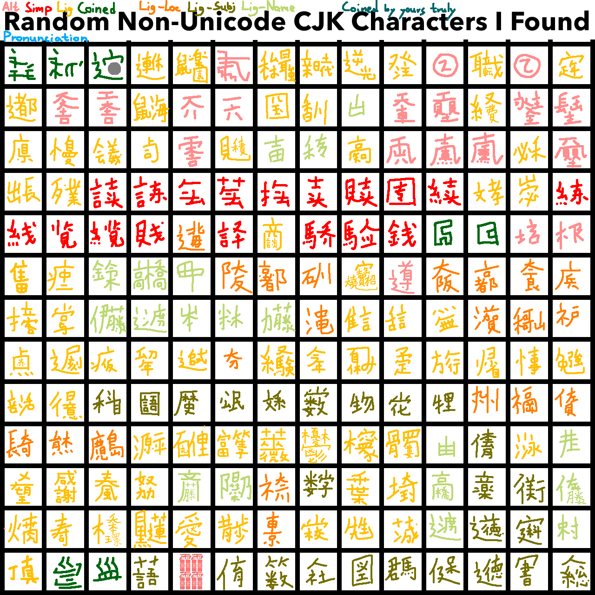

# cjkv(z) documentation

heavy wip

## notes

characters are generated by [zi.tools](https://zi.tools/?secondary=ids)

## plane 1

## ligatures\*

| f-id  | character    | ids      | meaning  | etymology | language | source |
| ----- | ------------- | -------- | -------- | --------- | -------- | ------ |
| L0001 |  | ⿴点赤    | red dot? | 点赤       | jp       | [^1]   |
| L0002 |  | ⿺辶⿸尸刻 | lateness | 遅刻       | jp       | [^1]   |

[^1]: <https://www.youtube.com/playlist?list=PL6Sk6v0AM6QChhOcXtB9kuancyq27ld6O>
