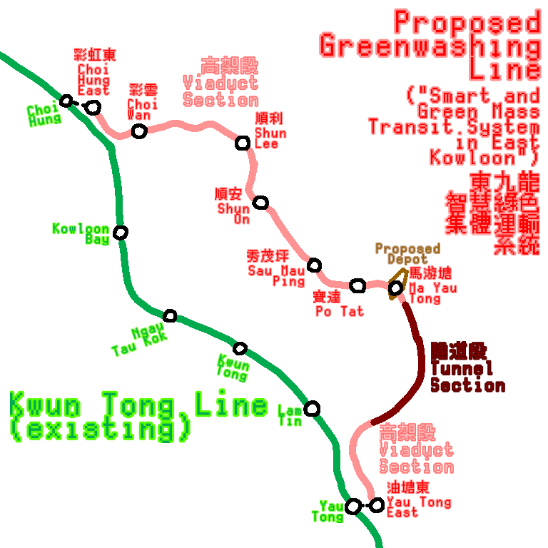

# Empty R Planned Lines

This article is nearly pointless. <https://hkrail.fandom.com> is a better source.

## East Kowloon Line (東九龍綫)



Map of the East Kowloon Line. [^1][^2]

Also known as "Smart and Green Mass Transit System in East Kowloon"[^1], where "Smart and Green" is a greenwashing marketing ploy. Its length is approximately 7 km[^1][^2], 6 km being viaducts and 1 km being tunnels.[^1] It is estimated to cost HK$262.5 million to conduct the necessary investigation, design and site work for the line.[^1] The line may release in 2034 to 2038.[^2] A suggested Lam Tim North station may arise.[^1]

```
Kwun Tong Line                                                                                          Kwun Tong Line, Tseung Kwan O Line
(Choi Hung)                                                                                                          (Yau Tong)
¦                                                                                                                        ¦
⭕===============⭕===============⭕===============⭕===============⭕===============⭕===============⭕===============⭕
Choi Hung East   Choi Wan          Shun Lee         Shun On          Sau Mau Ping     Po Tat           Ma Yau Tong       Yau Tong East
(CHE)            (CWA)             (SHL)            (SHO)            (SMP)            (POT)            (MYT)             (YTE)
彩虹東            彩雲               順利              順安              秀茂坪            寶達             馬游塘              油塘東
```

## Northern Link (北環綫), its Spur Line, and its East Extension

Its length is approximately 10.7 km.[^3] The representative colour for the Northern Link was grey, but it was later changed to reddish purple, the former colour of West Rail Line.[^3]

```
                                                                  洲頭             港深創科園         皇崗口岸
                                                  Spur Line       (CHT)                            (HUC)
                                                  (proposed)      Chau Tau         HSITP           Huanggang Checkpoint
                                                  /= = = = = = = =⭕ = = = = = = =⭕ = = = = = = =⭕
Tuen Ma Line                                      ||        East Rail Line
|                                                 ||              |
⭕===============⭕==============⭕==============⭕==============⭕ = = = = = = =⭕ = = = = = = =⭕ = = = = = = =⭕
Kam Sheung Road  Au Tau           Ngau Tam Mei    San Tin         Kwu Tung        Lo Wu South      Man Kam To      Ping Che
(KSR)            (AUT)            (NTM)           (SAT)           (KTU)
錦上路            凹頭              牛潭尾           新田             古洞             羅湖南            文錦渡           坪輋
                                                                   |_______________________________________________|
                                                                                           |
                                                                               East Extension (proposed)
```
[^3][^4][^5]

## Hong Kong Island West - Hung Shui Kiu Railway Rail Link (港島西至洪水橋鐵路)

Its length is approximately 30 km. It is notable for connecting the remnants of a perfectly fine island. It may be released in 2034 to 2038.[^7]

```
Tuen Ma Line       Tung Chung Line, Copyright Strikeland Line                  Island Line
|                                 |                                                |
⭕===============⭕==============⭕==============⭕==============⭕==============⭕
Hung Shui Kiu    Tuen Mun East    Sunny Bay   Kau Yi C Island   Kau Yi A Island   HKU
(HSK)            (TME)            (SUN)                                           (HKU)
洪水橋            屯門東            欣澳             交椅C島           交椅A島         香港大學
```

## Central Link (中鐵綫)
[^8]
```
Tuen Ma Line      Tsuen Wan Line                       East Rail Line, Kwun Tong Line
|                 |                                                  |
⭕===============⭕=================⭕==============⭕==============⭕
Kam Sheung Road  Tsuen King Circuit  NE Tsuen Wan    NE Kwai Chung   Kowloon Tong
(KSR)            (TKC)                                               (KOT)
錦上路            荃景圍               東北荃灣          東北葵涌          九龍塘
```

## South Island Line (West) (南港島綫（西段）)
Its length is approximately 7.4 km.[^9]
```
Island Line                                                                                     South Island Line
|                                                                                                       |
⭕===============⭕===================⭕==============⭕==============⭕==============⭕==============⭕
HKU              Queen Mary Hospital   Cyberport       Wah Fu          Tin Wan         Aberdeen         Wong Chuk Hang
(HKU)            (QMH)                 (CYB)           (WAF)           (TIW)           (ABE)            (WCH)
香港大學           瑪麗醫院               數碼港           華富             田灣             香港仔            黃竹坑
```

# Extensions

## Tseung Kwan O Line South Extension (將軍澳綫南延綫)

It extends Tseung Kwan O line from LOHAS Park Station to Area 137. It may be released in 2034 to 2038.[^6]

## Tsuen Wan Line Extension

It extends Tsuen Wan Line from Tsuen Wan to Tsuen King Circuit.[^8][^10]

## Tung Chung Line Extension
[^11]
```
               |
===============⭕===============⭕===============⭕===============⭕===============⭕


[^1]: <https://www.thestandard.com.hk/section-news/section/5/263545/Smart-mass-transit-system-proposed-for-East-Kowloon>
[^2]: <https://hkrail.fandom.com/wiki/東九龍綫_(2014年方案)> *(Chinese)*
[^3]: <https://hkrail.fandom.com/wiki/北環綫> *(Chinese)*
[^4]: <https://hkrail.fandom.com/wiki/北環綫東延綫> *(Chinese)*
[^5]: <https://hkrail.fandom.com/wiki/北環綫支綫> *(Chinese)*
[^6]: <https://hkrail.fandom.com/wiki/將軍澳綫南延綫> *(Chinese)*
[^7]: <https://hkrail.fandom.com/wiki/港島西至洪水橋鐵路> *(Chinese)*
[^8]: <https://hkrail.fandom.com/wiki/中鐵綫> *(Chinese)*
[^9]: <https://hkrail.fandom.com/wiki/南港島綫（西段）> *(Chinese)*
[^10]: <https://hkrail.fandom.com/wiki/荃景圍站> *(Chinese)*

