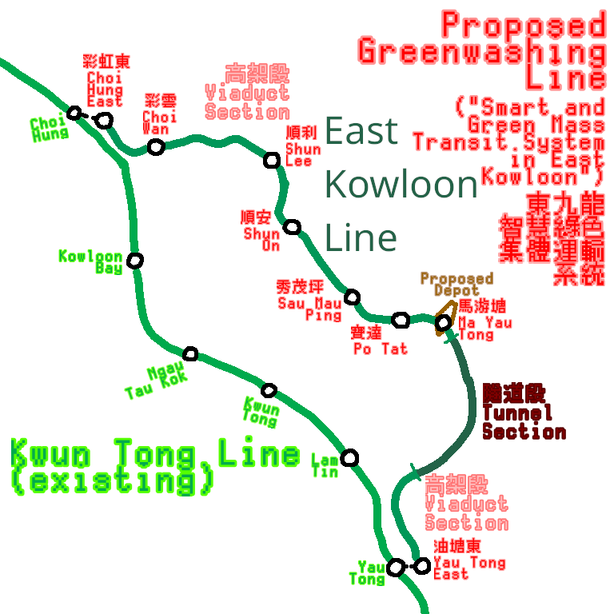

# Empty R Planned Lines

## East Kowloon Line (東九龍綫)

[^1][^2]

Also known as "Smart and Green Mass Transit System in East Kowloon", where "Smart and Green" is a greenwashing marketing ploy.

[^1]: <https://www.thestandard.com.hk/section-news/section/5/263545/Smart-mass-transit-system-proposed-for-East-Kowloon>
[^2]: <https://hkrail.fandom.com/wiki/東九龍綫_(2014年方案)>
